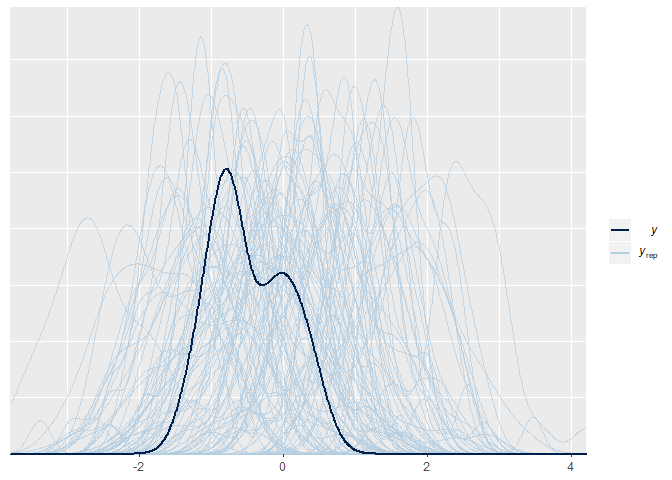
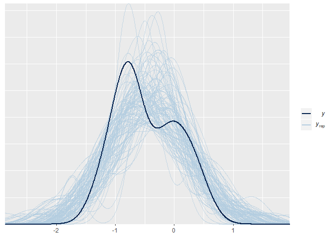
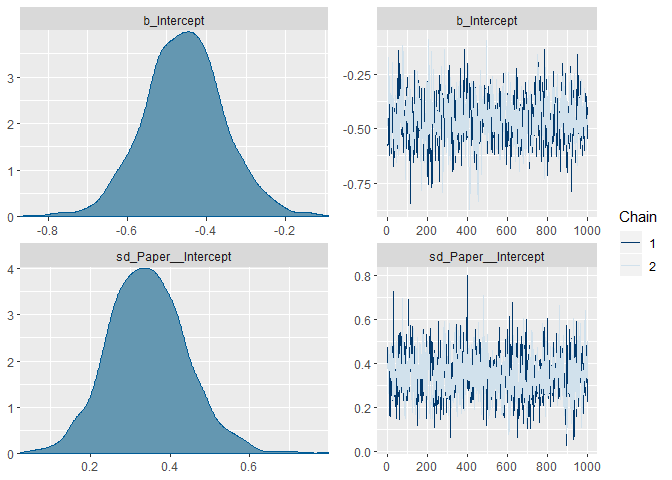
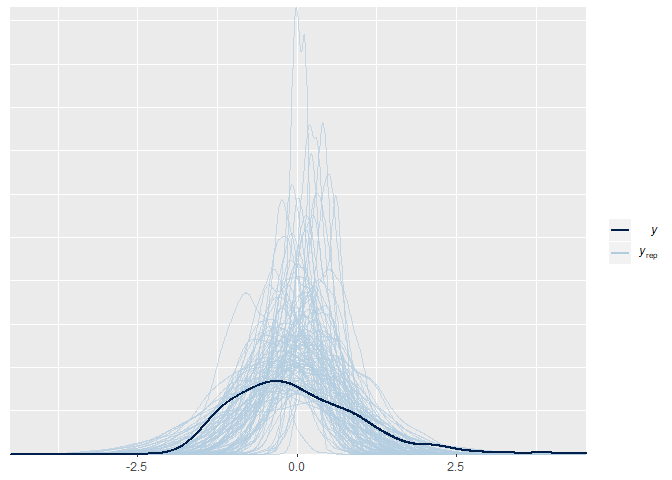
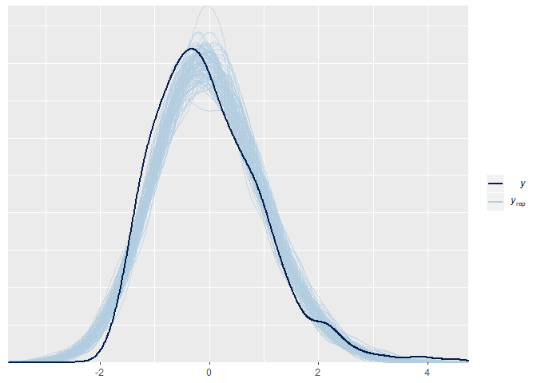
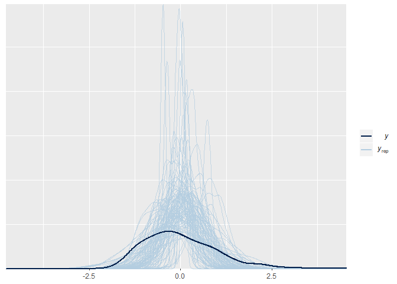
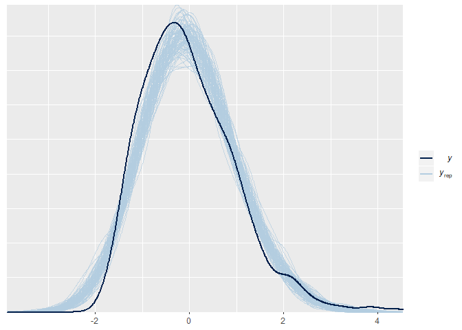
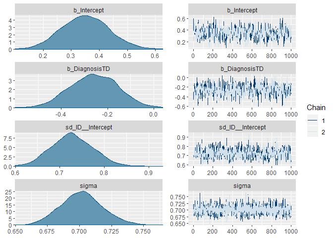

Assignment 4
------------

In this assignment we do the following: - we run a Bayesian
meta-analysis of pitch variability in ASD, based on previously published
literature - we analyze pitch variability in ASD in two new studies
using both a conservative and a meta-analytic prior - we assess the
difference in model quality and estimates using the two priors.

The questions you need to answer are: What are the consequences of using
a meta-analytic prior? Evaluate the models with conservative and
meta-analytic priors. Discuss the effects on estimates. Discuss the
effects on model quality. Discuss the role that meta-analytic priors
should have in scientific practice. Should we systematically use them?
Do they have drawbacks? Should we use them to complement more
conservative approaches? How does the use of meta-analytic priors you
suggest reflect the skeptical and cumulative nature of science?

### Step by step suggestions

Step 1: Perform a meta-analysis of pitch variability from previous
studies of voice in ASD - the data is available as
Ass4\_MetaAnalysisData.tsv - You should calculate Effect size (cohen’s
d) and Standard Error (uncertainty in the Cohen’s d) per each study,
using escalc() from the metafor package (also check the livecoding
intro) - N.B. we’re only interested in getting a meta-analytic effect
size for the meta-analytic prior (and not e.g. all the stuff on
publication bias). See a brms tutorial here:
<a href="https://vuorre.netlify.com/post/2016/09/29/meta-analysis-is-a-special-case-of-bayesian-multilevel-modeling/" class="uri">https://vuorre.netlify.com/post/2016/09/29/meta-analysis-is-a-special-case-of-bayesian-multilevel-modeling/</a>
The formula is EffectSize \| se(StandardError) \~ 1 + (1 \| Paper).
Don’t forget prior definition, model checking, etc. - Write down the
results of the meta-analysis in terms of a prior for step 2.

``` r
# Loading packages
pacman::p_load(
  tidyverse, 
  metafor,
  brms) 

# Loading data
MA_d <- read_delim("Ass4_MetaAnalysisData.tsv", delim = "\t")
```

    ## Parsed with column specification:
    ## cols(
    ##   .default = col_double(),
    ##   Paper = col_character(),
    ##   Author = col_character(),
    ##   Population = col_character(),
    ##   DiagnosisDetails = col_character(),
    ##   Language = col_character(),
    ##   Language2 = col_character(),
    ##   Task = col_character(),
    ##   Task2 = col_character(),
    ##   PitchMean_Units = col_character(),
    ##   PitchMeanASDvsTD = col_character(),
    ##   PitchRange_Units = col_character(),
    ##   PitchRangeASDvsTD = col_character(),
    ##   PitchSD_Units = col_character(),
    ##   PitchSDASDvsTD = col_character(),
    ##   PitchVariability_Units = col_character(),
    ##   PitchVariabilityASDvsTD = col_character(),
    ##   IntensityMean_Units = col_character(),
    ##   IntensityMeanASDvsTD = col_character(),
    ##   UtteranceDurationUnit = col_character(),
    ##   UtteranceDurationASDvsTD = col_character()
    ##   # ... with 5 more columns
    ## )

    ## See spec(...) for full column specifications.

``` r
# Tidying data (making sure the relevant variables are categorised correctly)
MA_d <- MA_d %>%
  mutate(
    PitchVariabilityASD_Mean = as.numeric(PitchVariabilityASD_Mean),
    PitchVariabilityTD_Mean = as.numeric(PitchVariabilityTD_Mean),
    PitchVariabilityASD_SD = as.numeric(PitchVariabilityASD_SD),
    PitchVariabilityTD_SD = as.numeric(PitchVariabilityTD_SD)
  )

# Only keeping the studies with a name (the NA rows have no data all)
MA_d <- MA_d %>%
  subset(!is.na(Paper))

# Using escalc() to calculate Effect size (cohen's d) and Standard Error (uncertainty in the Cohen's d) per each study
MA_d <- escalc(measure = "SMD", # Standardized mean difference
            n1i = TD_N, # Specifying group size of TD
            n2i = ASD_N, # Specifying group size of ASD
            m1i = PitchVariabilityTD_Mean, # Specifying mean of TD
            m2i = PitchVariabilityASD_Mean, # Specifying mean of ASD
            sd1i = PitchVariabilityTD_SD, # Specifying  SD of TD
            sd2i = PitchVariabilityASD_SD, # Specifying SD of ASD
            data = MA_d, # DATA
            slab = Paper) # (Optional) - labels for the studies

# Renaming yi (effect size) and calculting SE from vi (variance)
MA_d <- MA_d %>% 
  mutate(
    StandardError = sqrt(vi)
    ) %>%
  rename(
  EffectSize = yi
  )

# Looking at summary of the effect sizes and the standard errors
summary(MA_d$EffectSize) # Mean = -0.46
```

    ##     Min.  1st Qu.   Median     Mean  3rd Qu.     Max.     NA's 
    ## -1.29110 -0.81658 -0.65338 -0.46315 -0.05907  0.52031       11

``` r
summary(MA_d$StandardError) # Mean = 0.37
```

    ##    Min. 1st Qu.  Median    Mean 3rd Qu.    Max.    NA's 
    ##  0.2211  0.3176  0.3732  0.3673  0.4243  0.4826      11

``` r
# Specifying a formula
MA_f <- bf(EffectSize | se(StandardError) ~ 1 + (1 | Paper))
# Predicting from the mean including variability per paper

# Defining priors
get_prior(MA_f, data = MA_d, family = gaussian())
```

    ## Warning: Rows containing NAs were excluded from the model.

    ##                  prior     class      coef group resp dpar nlpar bound
    ## 1 student_t(3, -1, 10) Intercept                                      
    ## 2  student_t(3, 0, 10)        sd                                      
    ## 3                             sd           Paper                      
    ## 4                             sd Intercept Paper

``` r
MA_prior <- c(
  prior(normal(0, 1), class = Intercept), # mean of effect size = 0, because we are sceptical, meaning that we expect no effect, unless the data proves us wrong
  prior(normal(0, .3), class = sd) # Based on summary of sd (min, max) and equal chance of variation to both sides
)

# Prior predictive check
MA_m0 <- brm(
  MA_f,
  data = MA_d,
  family = gaussian(),
  prior = MA_prior,
  sample_prior = "only",
  chains = 2,
  cores = 3
)
```

    ## Warning: Rows containing NAs were excluded from the model.

    ## Compiling the C++ model

    ## Start sampling

``` r
pp_check(MA_m0, nsamples = 100)
```



``` r
# Fitting the model
MA_m1 <- brm(
  MA_f,
  data = MA_d,
  family = gaussian(),
  prior = MA_prior,
  sample_prior = T,
  chains = 2,
  cores = 3
)
```

    ## Warning: Rows containing NAs were excluded from the model.

    ## Compiling the C++ model
    ## Start sampling

``` r
# Posterior predictive check
pp_check(MA_m1, nsamples = 100)
```



``` r
# Chain checking
plot(MA_m1)
```



``` r
# Looking at the estimates
summary(MA_m1)
```

    ##  Family: gaussian 
    ##   Links: mu = identity; sigma = identity 
    ## Formula: EffectSize | se(StandardError) ~ 1 + (1 | Paper) 
    ##    Data: MA_d (Number of observations: 30) 
    ## Samples: 2 chains, each with iter = 2000; warmup = 1000; thin = 1;
    ##          total post-warmup samples = 2000
    ## 
    ## Group-Level Effects: 
    ## ~Paper (Number of levels: 19) 
    ##               Estimate Est.Error l-95% CI u-95% CI Rhat Bulk_ESS Tail_ESS
    ## sd(Intercept)     0.34      0.10     0.16     0.55 1.01      734      982
    ## 
    ## Population-Level Effects: 
    ##           Estimate Est.Error l-95% CI u-95% CI Rhat Bulk_ESS Tail_ESS
    ## Intercept    -0.46      0.10    -0.65    -0.25 1.00      814      903
    ## 
    ## Samples were drawn using sampling(NUTS). For each parameter, Bulk_ESS
    ## and Tail_ESS are effective sample size measures, and Rhat is the potential
    ## scale reduction factor on split chains (at convergence, Rhat = 1).

``` r
# RESULTS: MA effect mean = -0.44, SD = 0.09
# = On average an effect size of -0.43 in pitch variability (thus bigger variability in ASDs compared to TDs)

# Saving the results in variables to use later
MA_mean <- fixef(MA_m1)[[1]] # Defining the effect size of intercept as the mean
MA_se <- fixef(MA_m1)[[2]] # Defining the SD as mean_se (WHY SE?)

MA_heterogeneity = 0.32 # Defining the sigma (group-level effects) as heterogeneity
```

Step 2: Analyse pitch variability in ASD in two new studies for which
you have access to all the trials (not just study level estimates) - the
data is available as Ass4\_data.csv. Notice there are 2 studies
(language us, and language dk), multiple trials per participant, and a
few different ways to measure pitch variability (if in doubt, focus on
pitch IQR, interquartile range of the log of fundamental frequency) -
Also, let’s standardize the data, so that they are compatible with our
meta-analytic prior (Cohen’s d is measured in SDs). - Is there any
structure in the dataset that we should account for with random/varying
effects? How would you implement that? Or, if you don’t know how to do
bayesian random/varying effects or don’t want to bother, is there
anything we would need to simplify in the dataset?

``` r
# Loading data
d <- read_csv("Ass4_data.csv", col_types = cols(ID = col_character()))

# Standardising pitch variability (Pitch IQR) in order to put it on the same scale as the MA priors, just defined above (the results of the summary)
d <- d %>% mutate(
  PitchVariability = scale(Pitch_IQR) # Mean centred and sd-scaled
)

# Looking at the difference before and after scaling - and how the outcome is distributed
hist(d$Pitch_IQR)
```


``` r
hist(d$PitchVariability)
```


``` r
# Which structure?
## Language - Fixed effect
## Diagnosis - Fixed effect
## ID - Varying effect
```

Step 3: Build a regression model predicting Pitch variability from
Diagnosis. - how is the outcome distributed? (likelihood function). NB.
given we are standardizing, and the meta-analysis is on that scale,
gaussian is not a bad assumption. Lognormal would require us to convert
the prior to that scale. - how are the parameters of the likelihood
distribution distributed? Which predictors should they be conditioned
on? Start simple, with Diagnosis only. Add other predictors only if you
have the time and energy! - use a skeptical/conservative prior for the
effects of diagnosis. Remember you’ll need to motivate it. - Evaluate
model quality. Describe and plot the estimates.

``` r
# Looking at the difference before and after scaling - and how the outcome is distributed
hist(d$Pitch_IQR)
```


``` r
hist(d$PitchVariability) # Looks like a lognormal, but we assume it is gaussian
```


``` r
# Defining formulas
NewStudies_f0 <- bf(PitchVariability ~ 1 + Diagnosis + (1|ID))
# Using 1, because we want the change (the effect size)

# Defining sceptical priors
get_prior(NewStudies_f0, d, family = gaussian())
```

    ##                 prior     class        coef group resp dpar nlpar bound
    ## 1                             b                                        
    ## 2                             b DiagnosisTD                            
    ## 3 student_t(3, 0, 10) Intercept                                        
    ## 4 student_t(3, 0, 10)        sd                                        
    ## 5                            sd                ID                      
    ## 6                            sd   Intercept    ID                      
    ## 7 student_t(3, 0, 10)     sigma

``` r
NS_prior0 <- c(
  prior(normal(0, .3), class = Intercept), # Defining that ASD mean of pitch variability is 0 (being sceptical)
  prior(normal(0, .2), class = b), # Defining a slope/Difference in pitch variability going from ASD to TD (we are sceptical --> assuming no difference) Because data is scaled, it is in sds, we expect small effects, because it is a psychological study.
  prior(normal(0, .2), class = sd), # Variation between participants - assuming that participants are as different between participants as when going from ASD to TD.
  prior(normal(.5, .3), class = sigma) # Variation in the whole model - sd(d$pitchvariability) - we do not expect the model to be perfect, 0.3 in order to go to 1 and above.
)

# Prior predictive check
NS_m0_pc <- brm(
  NewStudies_f0,
  d,
  family = gaussian(),
  prior = NS_prior0,
  sample_prior = "only",
  chains = 2,
  cores = 3
)
```

    ## Compiling the C++ model

    ## Start sampling

``` r
pp_check(NS_m0_pc, nsamples=100)
```



``` r
# Fitting the model
NS_m0 <- brm(
  NewStudies_f0,
  d,
  family = gaussian(),
  prior = NS_prior0,
  sample_prior = T,
  chains = 2,
  cores = 3
)
```

    ## Compiling the C++ model
    ## Start sampling

``` r
# Posterior Predictive Check
pp_check(NS_m0, nsamples=100)
```



``` r
# Chain checking
plot(NS_m0)
```


``` r
# Hypothesis testing
plot(hypothesis(NS_m0, "DiagnosisTD < 0")) # Hypothesising that going from ASD to TD has a smaller effect than zero (based on MA)
```


``` r
# Showing that the hypothesis is supported, since the density is highest around -0.1 (thus smaller than 0). However, it crosses 0, and is not completely credible (but with most mass on the negative side of 0)
hypothesis(NS_m0, "DiagnosisTD < 0")
```

    ## Hypothesis Tests for class b:
    ##          Hypothesis Estimate Est.Error CI.Lower CI.Upper Evid.Ratio Post.Prob
    ## 1 (DiagnosisTD) < 0    -0.13      0.11    -0.32     0.05       8.71       0.9
    ##   Star
    ## 1     
    ## ---
    ## 'CI': 90%-CI for one-sided and 95%-CI for two-sided hypotheses.
    ## '*': For one-sided hypotheses, the posterior probability exceeds 95%;
    ## for two-sided hypotheses, the value tested against lies outside the 95%-CI.
    ## Posterior probabilities of point hypotheses assume equal prior probabilities.

``` r
# Estimate -0.14 - as illustrated in the plot (and most of the CIs are negative), ER = 8.95.

# More estimates
summary(NS_m0)
```

    ##  Family: gaussian 
    ##   Links: mu = identity; sigma = identity 
    ## Formula: PitchVariability ~ 1 + Diagnosis + (1 | ID) 
    ##    Data: d (Number of observations: 1074) 
    ## Samples: 2 chains, each with iter = 2000; warmup = 1000; thin = 1;
    ##          total post-warmup samples = 2000
    ## 
    ## Group-Level Effects: 
    ## ~ID (Number of levels: 149) 
    ##               Estimate Est.Error l-95% CI u-95% CI Rhat Bulk_ESS Tail_ESS
    ## sd(Intercept)     0.73      0.05     0.65     0.82 1.00      524     1100
    ## 
    ## Population-Level Effects: 
    ##             Estimate Est.Error l-95% CI u-95% CI Rhat Bulk_ESS Tail_ESS
    ## Intercept       0.29      0.08     0.12     0.46 1.00      487      692
    ## DiagnosisTD    -0.13      0.11    -0.35     0.08 1.01      445      692
    ## 
    ## Family Specific Parameters: 
    ##       Estimate Est.Error l-95% CI u-95% CI Rhat Bulk_ESS Tail_ESS
    ## sigma     0.70      0.02     0.67     0.74 1.00     2622     1382
    ## 
    ## Samples were drawn using sampling(NUTS). For each parameter, Bulk_ESS
    ## and Tail_ESS are effective sample size measures, and Rhat is the potential
    ## scale reduction factor on split chains (at convergence, Rhat = 1).

``` r
# So, mean of ASD variability measured in cohen's d = 0.29 (SDs), and 0.15 for TDs (thus more variability in ASDs compared to TDs). RHat of 1, ESS of bigger than 450.
```

Step 4: Now re-run the model with the meta-analytic prior - Evaluate
model quality. Describe and plot the estimates.

``` r
# Defining informed priors
NS_informed_prior0 <- c(
  prior(normal(0, 0.3), class = Intercept), # Defining that ASD mean of pitch variability is 0 (being sceptical)
  prior(normal(-0.44, 0.2), class = b), # Defining a slope/Difference in pitch variability going from ASD to TD (we are relying on our MA results)
  prior(normal(0, 0.2), class = sd), # Variation between participants - assuming that participants are as different between participants as when going from ASD to TD.
  prior(normal(0.32, .3), class = sigma) # Variation in the whole model(relying on information from MA), but we do not expect the model to be perfect
)

# Prior predictive check
NS_informed_m0_pc <- brm(
  NewStudies_f0,
  d,
  family = gaussian(),
  prior = NS_informed_prior0,
  sample_prior = "only",
  chains = 2,
  cores = 3
)
```

    ## Compiling the C++ model

    ## Start sampling

``` r
pp_check(NS_informed_m0_pc, nsamples = 100)
```



``` r
# Fitting the model
NS_informed_m0 <- brm(
  NewStudies_f0,
  d,
  family = gaussian(),
  prior = NS_informed_prior0,
  sample_prior = T,
  chains = 2,
  cores = 3
)
```

    ## Compiling the C++ model
    ## Start sampling

``` r
# Posterior predictive check
pp_check(NS_informed_m0, nsamples = 100)
```



``` r
# Chain checking
plot(NS_informed_m0)
```



``` r
# Hypothesis testing
plot(hypothesis(NS_informed_m0, "DiagnosisTD < 0"))
```


``` r
# Showing a negative tendency! Highest density around -0.3.
hypothesis(NS_informed_m0, "DiagnosisTD < 0")
```

    ## Hypothesis Tests for class b:
    ##          Hypothesis Estimate Est.Error CI.Lower CI.Upper Evid.Ratio Post.Prob
    ## 1 (DiagnosisTD) < 0    -0.26       0.1    -0.43    -0.09        199         1
    ##   Star
    ## 1    *
    ## ---
    ## 'CI': 90%-CI for one-sided and 95%-CI for two-sided hypotheses.
    ## '*': For one-sided hypotheses, the posterior probability exceeds 95%;
    ## for two-sided hypotheses, the value tested against lies outside the 95%-CI.
    ## Posterior probabilities of point hypotheses assume equal prior probabilities.

``` r
# -0.27 in effect size, CIs not crossing zero - clearly negative, evidence ratio of 249.

# More estimates
summary(NS_informed_m0)
```

    ##  Family: gaussian 
    ##   Links: mu = identity; sigma = identity 
    ## Formula: PitchVariability ~ 1 + Diagnosis + (1 | ID) 
    ##    Data: d (Number of observations: 1074) 
    ## Samples: 2 chains, each with iter = 2000; warmup = 1000; thin = 1;
    ##          total post-warmup samples = 2000
    ## 
    ## Group-Level Effects: 
    ## ~ID (Number of levels: 149) 
    ##               Estimate Est.Error l-95% CI u-95% CI Rhat Bulk_ESS Tail_ESS
    ## sd(Intercept)     0.73      0.05     0.64     0.82 1.01      634     1296
    ## 
    ## Population-Level Effects: 
    ##             Estimate Est.Error l-95% CI u-95% CI Rhat Bulk_ESS Tail_ESS
    ## Intercept       0.35      0.08     0.19     0.51 1.00      513      798
    ## DiagnosisTD    -0.26      0.10    -0.47    -0.06 1.01      543      959
    ## 
    ## Family Specific Parameters: 
    ##       Estimate Est.Error l-95% CI u-95% CI Rhat Bulk_ESS Tail_ESS
    ## sigma     0.70      0.02     0.67     0.73 1.00     2371     1630
    ## 
    ## Samples were drawn using sampling(NUTS). For each parameter, Bulk_ESS
    ## and Tail_ESS are effective sample size measures, and Rhat is the potential
    ## scale reduction factor on split chains (at convergence, Rhat = 1).

``` r
# Showing that pitch variability for ASDs is 0.35, while for TDs it is 0.08. Rhat of 1, ESS of 440 and above (of 2000 iterations).
```

Step 5: Compare the models - Plot priors and posteriors of the diagnosis
effect in both models - Compare posteriors between the two models -
Compare the two models (LOO) - Discuss how they compare and whether any
of them is best.

``` r
# Adding criteria to the models in order to compare
NS_informed_m0 <- add_criterion(NS_informed_m0, criterion = "loo", reloo = T)
```

    ## 6 problematic observation(s) found.
    ## The model will be refit 6 times.

    ## 
    ## Fitting model 1 out of 6 (leaving out observation 125)

    ## 
    ## Fitting model 2 out of 6 (leaving out observation 461)

    ## 
    ## Fitting model 3 out of 6 (leaving out observation 639)

    ## 
    ## Fitting model 4 out of 6 (leaving out observation 640)

    ## 
    ## Fitting model 5 out of 6 (leaving out observation 770)

    ## 
    ## Fitting model 6 out of 6 (leaving out observation 976)

    ## Start sampling
    ## Start sampling
    ## Start sampling
    ## Start sampling
    ## Start sampling
    ## Start sampling

``` r
NS_m0 <- add_criterion(NS_m0, criterion = "loo", reloo = T)
```

    ## 3 problematic observation(s) found.
    ## The model will be refit 3 times.

    ## 
    ## Fitting model 1 out of 3 (leaving out observation 244)

    ## 
    ## Fitting model 2 out of 3 (leaving out observation 639)

    ## 
    ## Fitting model 3 out of 3 (leaving out observation 640)

    ## Start sampling
    ## Start sampling
    ## Start sampling

``` r
# Comparing the models
loo_compare(NS_m0,
            NS_informed_m0)
```

    ##                elpd_diff se_diff
    ## NS_m0           0.0       0.0   
    ## NS_informed_m0 -0.3       0.8

``` r
# Comparing the models
loo_model_weights(NS_m0, NS_informed_m0)
```

    ## Warning: Some Pareto k diagnostic values are too high. See help('pareto-k-diagnostic') for details.

    ## Warning: Some Pareto k diagnostic values are too high. See help('pareto-k-diagnostic') for details.

    ## Method: stacking
    ## ------
    ##                weight
    ## NS_m0          0.000 
    ## NS_informed_m0 1.000

``` r
# Plotting and comparing the posteriors
plot(hypothesis(NS_m0, "DiagnosisTD < 0"))
```


``` r
plot(hypothesis(NS_informed_m0, "DiagnosisTD < 0"))
```


Step 6: Prepare a nice write up of the analysis and answer the questions
at the top.

Optional step 7: how skeptical should a prior be? - Try different levels
of skepticism and compare them using LOO.

Optional step 8: Include other predictors - Do age, gender and education
improve the model? - Should they be main effects or interactions?
